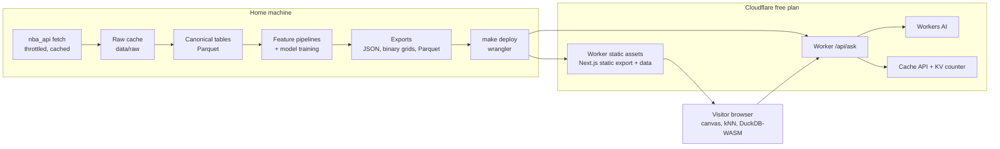

# NBA data hub for svej.org: build plan

Owner: Svej Patel · Drafted September 2026 · Status: ready for Phase 0

## How to use this document (read first, Claude)

This is the source of truth for building an NBA data hub with four interactive views. Work one phase at a time, in the order listed under "Phases." At the end of each phase, stop and report: what you built, how to run it, key metrics, and open questions. Wait for my approval before starting the next phase.

Some facts in this plan (API endpoint names, parameters, model IDs, platform limits) come from documentation that changes. Before relying on any of them, verify against current docs or by running code, and note any correction in `docs/decisions.md`. Don't invent endpoint parameters or model names.

Two constraints override everything else: the project must cost $0 per month, and it must use very little server compute. If a task seems to need a paid service, a credit card, or an always-on server, stop and ask.

## Context and goals

I'm an AI/ML engineer targeting AI Engineer and Forward Deployed Engineer roles. This hub is a portfolio piece that shows end-to-end ML and software engineering on a subject I love. It will live at a subdomain of svej.org (working name `nba.svej.org`).

The hub has four views:

| View | One-line pitch | Main skill it shows |
|---|---|---|
| Player style map | Every player-season on a map, placed by how they play | Embeddings, clustering, similarity search |
| Ask the box score | Plain-English questions answered with SQL over real stats | LLM engineering, guardrails, evals |
| Shot quality court | Separates good shot selection from tough shot making | Supervised modeling, calibration |
| Game flow | Win probability through every game, with the biggest swings | Sequential data, probabilistic modeling |

A methodology page ties them together with the pipeline diagram, evaluation results, and limitations. Hiring managers will read it, so treat it as a first-class deliverable.

## Hard constraints and the budgets they imply

All heavy compute happens offline on my machine. The site ships precomputed files, the visitor's browser does light computation, and the only server-side code is a small Worker that forwards "Ask the box score" questions to a free LLM allocation.

Platform limits (checked September 2026; re-verify before launch):

| Service | Free-plan limit that matters | Design consequence |
|---|---|---|
| Cloudflare Workers static assets | Asset requests are free and unlimited; 20,000 files per Worker version; 25 MiB per file | Serve the whole site as static assets. Keep total files under 2,000 and every file well under 25 MiB. |
| Cloudflare Workers (code) | 100,000 requests/day; 10 ms CPU per request (waiting on I/O doesn't count); 5 cron triggers per account | Only `/api/*` runs Worker code. Keep handlers thin. |
| Cloudflare Workers AI | 10,000 neurons/day, resetting at 00:00 UTC; exceeding it on the free plan fails rather than bills | Cache answers, precompute example questions, degrade gracefully when the allocation runs out. |
| Workers KV | About 1 GB storage, 100,000 reads and 1,000 writes per day | Use KV only for low-write data like a daily counter. Use the Cache API for answer caching. |
| stats.nba.com (via nba_api) | Undocumented; known to time out from cloud-provider IPs | Run all data fetching from my home machine. Throttle and cache everything. |

Cloudflare is steering new projects toward Workers static assets rather than Pages, so use one Worker that serves the static site and handles `/api/ask`.

Performance budgets:

| Item | Budget |
|---|---|
| Landing page JavaScript | Under 150 KB gzipped |
| Style map data file | Under 2 MB gzipped |
| Shot court: one player shard | Under 300 KB gzipped; xFG lookup grid under 100 KB |
| Game flow: one monthly bundle | Under 1 MB gzipped |
| DuckDB-WASM | Loaded lazily from jsDelivr, only on `/ask` |
| Worker CPU per request | Under 5 ms |
| Workers AI | Under 10,000 neurons/day total, including evals |
| KV writes | Under 500/day |
| Full backfill | Resumable; a few hours at about one request per second is fine |
| Nightly refresh | Under 15 minutes |

## Architecture



Code lives in a public GitHub repo. Data never goes into git, because nightly data commits would bloat the repo. Instead, `make deploy` builds the site, copies the latest exports into the static assets folder, and runs `wrangler deploy` from my machine. GitHub Actions runs lint and tests only.

Stack:

| Layer | Choice |
|---|---|
| Pipeline | Python 3.12, uv, polars (pandas where a library needs it), scikit-learn, umap-learn, LightGBM, joblib, pydantic for export schemas, pytest, ruff |
| Web | Next.js with static export, TypeScript, d3 modules (scale, zoom, quadtree, shape), HTML canvas for dense plots, `@duckdb/duckdb-wasm` on `/ask`, vitest, eslint |
| Server | One Cloudflare Worker (TypeScript) with an AI binding, a KV binding, and static assets |
| Security | Cloudflare Turnstile on the ask box; rate limiting via whatever the free plan offers (verify: Workers Rate Limiting binding or a WAF rule) |
| Analytics | Cloudflare Web Analytics (free, no cookies) |

## Repository layout

```
nba-hub/
  PLAN.md
  README.md
  docs/
    decisions.md            # short log of notable choices and corrections
    player-style-map-spec.md
  pipeline/
    pyproject.toml
    src/hub/
      fetch/                # nba_api wrappers, throttle, retry, raw cache
      tables/               # canonical tables + data quality checks
      style/                # style map features and models
      shots/                # xFG model, player metrics, hex aggregates, grid
      gameflow/             # pbp parsing, Elo, win probability, game summaries
      ask/                  # DuckDB export, schema card, example gallery, evals
      export/               # writers + pydantic schemas
    tests/
    notebooks/
  data/                     # gitignored: raw/, tables/, models/, export/
  web/
    app/                    # routes: /, /style-map, /ask, /shot-quality, /game-flow, /methodology
    components/
    lib/                    # loaders, knn.ts, winprob.ts, xfg.ts, duckdb.ts, sql-guard.ts
  worker/
    src/index.ts
    wrangler.jsonc
  evals/ask/golden.jsonl
  Makefile                  # fetch, tables, build-<feature>, export, web, deploy, test
  .github/workflows/ci.yml
```

## Shared data foundation

Season scope for v1 is 2015–16 through the current season, which keeps every feature on the same complete data. Game flow uses the three most recent completed seasons plus the current one to keep the play-by-play backfill manageable. Extending the style map back to 1996–97 is a stretch goal.

Fetch-layer rules:

- Throttle to about one request per second with jitter, and retry with exponential backoff.
- Cache every raw response on disk, keyed by endpoint and parameters. Never refetch a completed season.
- Make the backfill resumable, with progress logging.
- Put timeouts on every call and fail loudly with a clear message if stats.nba.com is unreachable.

Endpoints to verify and use (names from nba_api; confirm parameters before writing code):

| Need | Likely endpoint | Calls per season |
|---|---|---|
| Player and team box scores per game | `LeagueGameLog` (player and team modes) | 2 |
| Season stats (base, advanced, scoring) | `LeagueDashPlayerStats` | about 3 |
| Shot zones | `LeagueDashPlayerShotLocations` | 1 |
| Tracking stats | `LeagueDashPtStats` (several measure types) | about 8 |
| Play types | `SynergyPlayTypes` | about 10–20 |
| Every shot with location | `ShotChartDetail` (league-wide if supported, otherwise per team) | 1–30 |
| Play-by-play | `PlayByPlayV3` | about 1,230 (one per game) |
| Player bios | `PlayerIndex` or `CommonAllPlayers` | 1 |

Canonical tables (Parquet, in `data/tables/`): `players`, `teams`, `games`, `player_game_logs`, `team_game_logs`, `player_seasons`, `shots`, `pbp_events`. Every table gets data quality checks: row counts per season within expected ranges, null rates, unique keys, and join integrity (every `player_id` in logs exists in `players`).

## Feature 1: Player style map

The full spec is already written: https://claude.ai/artifact/RsfXpuikeagRkLfxgrUtz6 (copy it into `docs/player-style-map-spec.md`). For v1, build Modern mode only (2015–16 onward, era-adjusted). The summary below adds the low-compute details.

**Pipeline.** Build player-season features (shot diet, role, rebounding and defense, self-creation, ball handling, shooting mode, touch location, play types) with shrinkage and within-season standardization. Fit PCA (about 12 components), a Gaussian mixture for archetypes, and UMAP for layout. Freeze all three models for the season, and use `transform()` for nightly current-season updates.

**Exports.** `style_map_modern.json` (about 4,000 rows with ids, names, coordinates, PCA vector, archetype probabilities, fingerprint, and panel stats), `archetypes.json`, and `style_model_meta.json` (scaler, group weights, PCA components, feature names, version, data-through date).

**Browser compute.** Nearest neighbors are a brute-force cosine search over about 4,000 short vectors, done in a few milliseconds with no precomputation. Hover hit-testing uses d3-quadtree over a canvas.

**UI.** Search, color-by menu, archetype legend as a filter, side panel with archetype mix, diverging fingerprint bars, top-8 comps, career path, and compare. Shareable URL state. Bottom sheet on mobile.

**Evals.** Career continuity recall@10, position predictability, cluster stability (adjusted Rand index), a hand-written list of about 30 consensus comps, and spot checks.

**Acceptance criteria:**

- [ ] Map renders all points and stays responsive while panning and zooming on a mid-range phone.
- [ ] Neighbor search returns in under 20 ms in the browser.
- [ ] Nightly refresh adds current-season points without moving existing ones.
- [ ] Eval results are exported to a JSON file the methodology page reads.

## Feature 2: Ask the box score

**User story.** A visitor types a question like "Who had the most 30-point games on fewer than 15 shots last season?" and gets a table, a simple chart when it fits, and the SQL that produced it.

**Data.** Export DuckDB-friendly Parquet files (zstd): `players`, `teams`, `games`, `player_game_logs` (one file per season), `team_game_logs`, and `player_seasons`. `player_seasons` is enriched by the other features over time (archetype and top comps from the style map, shot-making metrics from the shot court, and later excitement index on `games` from game flow). Bump `schema_version` whenever the schema changes.

**Request flow:**

1. The browser sends `{question, schema_version, turnstile_token}` to `POST /api/ask`.
2. The Worker checks Turnstile, enforces a 300-character limit, applies rate limiting, and looks up the Cache API using a hash of the normalized question plus the schema version.
3. On a cache miss, the Worker builds the prompt (system rules, compact schema card, 8–12 few-shot examples, the question inside delimiters, treated as data) and calls Workers AI.
4. The Worker extracts exactly one SQL statement, runs it through the shared SQL guard, and only caches it if it passes. This prevents a bad query from being served to other visitors.
5. The browser runs the SQL guard again, then executes the query in DuckDB-WASM in a web worker with a timeout.
6. The browser renders a table, auto-selects a chart (category plus measure gives a bar chart, date plus measure gives a line chart), and shows the SQL in a collapsible block.
7. If execution fails, the browser makes one repair attempt by sending the error and the failed SQL back to `/api/ask`. That attempt counts toward the budget.

**SQL guard** (shared TypeScript module used by both the Worker and the browser):

- Allow a single `SELECT` or `WITH` statement only.
- Reject `ATTACH`, `COPY`, `INSTALL`, `LOAD`, `PRAGMA`, `SET`, `EXPORT`, `CREATE`, `INSERT`, `UPDATE`, `DELETE`, `DROP`, and any file or URL reading functions.
- Allow only known tables and views.
- Enforce `LIMIT 200` on every query.

**DuckDB hardening.** At startup, load the Parquet files into in-memory tables, then disable external access and lock the configuration. Verify the exact setting names for the current DuckDB-WASM version. Load DuckDB-WASM from jsDelivr so its files don't count against the site's file limits.

**Model choice.** Keep the model ID in config with an ordered fallback list, because Workers AI retires models over time. List the current catalog with `npx wrangler ai models list`, then pick the model with the best execution accuracy on the golden set that fits the neuron budget. Log the `usage` field from every response to measure neurons per question.

**Staying free:**

- Build a gallery of 20–30 curated questions with SQL written and validated at build time (`ask_examples.json`). Show them as clickable chips; they use zero LLM calls.
- Cache answers with the Cache API, not KV, to stay clear of the KV write limit.
- Keep a daily question counter in KV and stop calling the model at a safe threshold.
- When the allocation is used up or the model errors, show: "Today's free question budget is used up. Try one of these instead." followed by the gallery.
- Set the Worker to fail open so the static site keeps working if the daily Worker request limit is ever reached.

**Evals.** Write `evals/ask/golden.jsonl` with about 60 questions across easy, medium, and hard, including a few cross-feature questions and a few that should be refused (off-topic or unanswerable from the schema). The metric is execution accuracy: result sets match, ignoring order unless the question asks for ordering. The eval runner uses the same prompt builder as the Worker. Run it on demand only, since it spends neurons (estimate the cost and keep it under half a day's allocation). Publish accuracy by category and model version on the methodology page.

**Acceptance criteria:**

- [ ] Gallery questions work with the Worker turned off.
- [ ] SQL guard has adversarial unit tests (multiple statements, comments hiding keywords, file-reading functions, URL reads, missing LIMIT) and all pass.
- [ ] The prompt refuses non-stats requests with a canned message.
- [ ] Golden-set execution accuracy is reported, and the model choice is recorded in `docs/decisions.md`.
- [ ] Worker CPU stays under 5 ms per request, measured.

## Feature 3: Shot quality court

**Data.** Every field goal attempt from 2015–16 onward (on the order of 200,000 per season). Verify coordinate units and the hoop's origin in `ShotChartDetail`.

**Features.** Court location (x, y), distance, angle, shot value, action type grouped into about 10 families (layup, dunk, hook, floater, catch-and-shoot style jumper, pull-up, step-back, fadeaway, tip, alley-oop; adjust to what the data supports), period, seconds left in period, and an end-of-quarter heave flag. Leave out player identity, since the model estimates what an average player would shoot.

**Model.** Train a LightGBM classifier with a time-based split (train on earlier seasons, validate on the most recent completed one). Compare against a logistic regression baseline with distance splines, zone, and action family. Report log loss, Brier score, AUC, and a calibration curve. Calibrate if needed.

**Low-compute serving.** Don't ship the model. Precompute an xFG lookup grid instead: 1-foot cells across the half court, for each action family, quantized to one byte per cell and stored as a small binary file. The browser does an array lookup, and the "click anywhere on the court" feature uses the same grid. Add a parity test that checks sampled grid values against the Python model.

**Player metrics** (per player-season, with shrinkage for small samples):

- Shot selection: average expected points per shot compared with league average.
- Shot making: actual points minus expected points, per shot.
- Attempts, FG%, and xFG% by zone.

**Exports:**

- Per-player hex aggregates (attempts, makes, sum of xFG per hex), with hex IDs computed in Python on a fixed grid. Shard by `player_id % 32` so each season has 32 files.
- A league-average hex file per season.
- `shot_quadrant_{season}.json` for the all-players scatter.
- The xFG grid binary.

**UI.**

- A court with hexes sized by frequency and colored by FG% minus xFG% on a diverging scale, with a toggle to color by xFG% instead.
- Player search and a season picker.
- A shot selection vs. shot making quadrant scatter of all qualified players.
- An action-type dropdown for the click-anywhere xFG tooltip.

**Limitations to state.** No defender distance in public shot-level data. Fouled shots and and-ones aren't modeled.

**Acceptance criteria:**

- [x] Holdout calibration is close across deciles (report the numbers; target within about 2–3 percentage points).
- [x] Grid parity test passes.
- [x] Court renders in under 100 ms after data loads, and a player shard stays under budget.

## Feature 4: Game flow

**Data.** `PlayByPlayV3` for the three most recent completed seasons plus the current season, and `LeagueGameLog` for every game since 2015–16 to compute Elo.

**Parsing.** Turn events into game states: period, seconds remaining (handle overtime periods of 5 minutes), home and away score, score margin, and team in possession. Check whether the endpoint exposes possession. If it doesn't, derive it from event types (made shots, defensive rebounds, turnovers, and so on). Build unit tests from a few hand-checked games.

**Pregame strength.** Compute FiveThirtyEight-style Elo from game results (K around 20, home-court advantage and between-season regression tuned on the data). This keeps the model free of betting-line data.

**Model.** Train a logistic regression with engineered features: margin, margin divided by the square root of seconds remaining plus one, Elo difference scaled by the share of time remaining, possession, and home court. Compare against LightGBM with a monotonic constraint on margin. Split by game, never by event, to avoid leakage. Report Brier score, log loss, and calibration by time bucket (with special attention to the final two minutes). Ship the logistic regression if its calibration is close to the GBM's; it runs as a few lines of TypeScript and makes a future live mode trivial. Add a parity test between the Python and TypeScript implementations (tolerance 1e-6).

**Per-game summaries:**

- A downsampled win-probability series (at most about 150 points per game).
- The top five plays by absolute change in win probability.
- An excitement index (sum of absolute changes).
- A comeback factor (the winner's lowest win probability).

**Exports.** A `games_{season}.json` index (id, date, teams, score, excitement, comeback) and monthly bundles `gameflow_{season}_{month}.json`.

**UI.**

- A game picker by date or team.
- "Most exciting" and "biggest comebacks" lists for the season.
- The win-probability chart with hover details (play description, score, clock) and annotated swings.
- A link to the calibration chart on the methodology page.

**Stretch: live mode (off by default).** Only build this if it fits free limits and the data source's terms allow it. The browser polls a Worker endpoint every 30 seconds or more; the Worker fetches the live play-by-play feed and caches it briefly, and the browser computes win probability locally. Include a daily request guard.

**Acceptance criteria:**

- [x] Parser tests pass on hand-checked games.
- [x] Calibration by time bucket is reported.
- [x] TypeScript parity test passes.
- [x] A game view loads with a single bundle fetch.

## Site shell and methodology page

**Landing page.** Four cards with a short pitch, a thumbnail for each view, the data-through date, and links to the GitHub repo and svej.org.

**Methodology page.**

- The architecture diagram.
- The data sources and season coverage.
- A short section per feature on features, models, and evals, with charts read from exported eval JSON.
- A "how this stays free" section with the budgets above.
- Limitations.
- The model and schema versions.

**Shared requirements:**

- Light and dark mode.
- Keyboard-accessible search.
- A color-blind-aware palette with legends that don't rely on color alone.
- Static Open Graph images for each view.
- An attribution footer.

**Brand hygiene.** Noncommercial. No NBA or team logos. Initials instead of player headshots. Review the stats.nba.com terms of use before launch.

## Phases

| Phase | Scope | Checkpoint deliverable |
|---|---|---|
| 0. Scaffold | Repo layout, uv and pnpm setup, lint and test tooling, Makefile, CI (lint and test only), a Worker serving the Next.js static export on a workers.dev URL with a stub `/api/health` | Deployed hello-world URL; `make test` passes |
| 1. Data foundation | Fetch layer, raw cache, canonical tables for 2015–16 onward, quality checks, endpoint verification notes | Data quality report; list of any endpoint corrections |
| 2. Player style map | Feature 1 end to end | Deployed view; eval summary |
| 3. Ask the box score | Feature 2 end to end, including gallery, guardrails, and golden-set eval | Deployed view; accuracy report; measured neurons per question |
| 4. Shot quality court | Feature 3 end to end | Deployed view; calibration report |
| 5. Game flow | Feature 4 end to end | Deployed view; calibration report |
| 6. Launch | Landing and methodology pages, analytics, custom domain on svej.org, nightly refresh job on my machine, README with architecture and screenshots | Live site before the 2026–27 season tips off |
| 7. Stretch | All-eras style map, build-a-player, learned embedding vs. PCA comparison, live game flow | One at a time, on request |

Ask the box score comes second on purpose: it's the most relevant piece for the roles I'm targeting, and it gets richer as later phases add columns to `player_seasons` and `games`.

## Working agreements

- Keep commits small, with clear messages. Open a short entry in `docs/decisions.md` for any notable choice or correction.
- Every export has a pydantic schema. The web app has matching TypeScript types, and CI validates small fixture exports against both.
- Prefer boring, well-maintained dependencies. Ask before adding anything heavy to the web bundle.
- No secrets in the repo. The Workers AI binding needs no API key; wrangler auth stays on my machine.
- Respect the data source: throttle, cache, and never hammer endpoints while debugging (use the raw cache and fixtures).
- Tests to include at minimum: feature engineering, play-by-play parsing, SQL guard adversarial cases, xFG grid parity, win-probability parity, and export schema validation.
- If a phase turns out much bigger than planned, stop and propose a smaller cut rather than pushing through.

## Open decisions for Svej

- Project name and final subdomain.
- Moving svej.org DNS to Cloudflare, which the custom domain requires. The existing `flights.svej.org` record would stay as a DNS-only record pointing at the current VM.
- Which home machine runs the nightly refresh, and whether it's on often enough. Weekly refreshes are acceptable if not.
- Final LLM model, chosen after the Phase 3 eval.