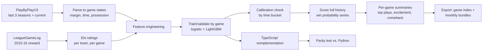

# Game flow: view spec

Draft v0.1 · September 2026 · for the nba-atlas hub

## What it is

A win-probability line chart for every game, built from play-by-play data, showing how each team's chances shifted possession by possession. Visitors can browse any game, see its biggest swings annotated on the chart, and browse season-wide lists of the most exciting games and the biggest comebacks. A calibration page proves the model's probabilities mean what they claim: when it says a team has a 70% chance to win, that team should win about 70% of the time.

In under a minute, a visitor should be able to answer: how did this game actually unfold, what was the turning point, and how confident should we really be in a probability the model reports mid-game.

## Guiding principles

**Calibration is the deliverable, not a footnote.** A win-probability model that "feels right" but isn't checked against outcomes is just vibes with a percentage sign. The calibration-by-time-bucket chart goes on the methodology page as a first-class result, not an afterthought.

**No betting-line data.** The model is built entirely from public play-by-play and season results, using Elo for pregame strength instead of a market-derived line. This keeps the whole pipeline free and avoids a data dependency that could disappear or require a paid subscription.

**Simple model, if it's competitive.** A logistic regression that runs as a few lines of JavaScript is worth more here than a marginally better black-box model, because it lets a future live-mode feature compute win probability entirely client-side with zero server cost.

**Split by game, always.** Any train/validation split by individual event risks leaking information about how a specific game ends into the training data for that same game. Every split in this feature is by game ID.

## Unit of analysis and scope

Two related units: (1) individual play-by-play events, used to build the state sequence within a game, and (2) games, used for the pregame Elo model and to define train/validation splits.

Scope: the three most recent completed seasons plus the current season for play-by-play (an ambitious backfill target given per-game API calls), and every game back to 2015–16 for the Elo ratings, since Elo only needs final scores and is cheap to compute for a full decade.

## Data and parsing

**Source.** `PlayByPlayV3` per game (confirm the exact endpoint name and response shape before writing the parser — the API has changed structure before). At roughly 1,230 games per season, backfilling three seasons is about 3,700 calls; throttle accordingly and expect it to take a few hours.

**Game state per event.** Period, seconds remaining in the period (regular periods are 12 minutes; overtime periods are 5 minutes — confirm the clock format in the raw event and normalize it), home score, away score, score margin (home minus away), and team currently in possession.

**Possession.** Check whether the endpoint exposes possession directly (some NBA play-by-play feeds do via a team-ID field on each event). If not, derive it from event sequences: a made shot or defensive rebound flips possession to the other team; an offensive rebound keeps it; a turnover flips it; free throws inherit the possession of the shooting foul. Build this derivation against a handful of manually verified games before trusting it at scale — possession logic is a common source of subtle bugs.

**Time remaining in game.** Computed as a running total across periods, needed for the "seconds remaining" feature. Handle overtime periods explicitly rather than assuming a fixed 4-period game.

## Pregame strength: Elo

Compute FiveThirtyEight-style Elo ratings from final scores across the full history back to 2015–16:

- Standard Elo update after each game, with a K-factor around 20 (start there, then tune against calibration — described below).
- A home-court advantage adjustment added to the home team's effective rating before computing win probability.
- Between-season regression toward the mean (typically 25–35% toward average), so a team's rating doesn't fully carry over from a very good or very bad prior season.
- Optionally, a margin-of-victory multiplier (as FiveThirtyEight used), which rewards blowouts more than close wins. Worth trying, but only keep it if it improves calibration on the validation season — it's an extra parameter to tune and can overfit.

Elo avoids any dependency on betting markets or injury reports, which keeps the whole feature free and reproducible from public box scores alone.

## In-game model

### Features

| Feature | Description |
|---|---|
| Score margin | Home score minus away score, at the current event |
| Margin over time-decay | Margin divided by the square root of (seconds remaining + 1) — captures that a 10-point lead means much less with 40 minutes left than with 2 |
| Elo difference, time-scaled | Pregame Elo difference (home minus away, home-court adjusted), multiplied by the fraction of game time remaining — its influence should fade as the game itself provides more information |
| Possession | Which team currently has the ball |
| Home court | Constant home-court indicator, folded in via the Elo adjustment above rather than as a separate raw feature, to avoid double-counting |

### Candidate models

**Logistic regression** on the features above. Ship this if its calibration is close to the more flexible model's — it's simple, fast, auditable, and portable to client-side JavaScript for a future live mode.

**LightGBM with a monotonic constraint on margin** (win probability must not decrease as the home team's margin increases, holding other features fixed) as the comparison model. The monotonic constraint matters here specifically because an unconstrained tree model can produce implausible non-monotonic quirks in sparse regions of the feature space (a rare combination of huge margin and specific time-remaining bucket), which would look obviously wrong on a chart even if it barely moves an accuracy metric.

### Evaluation

Split by game (not by event) into training and a held-out validation season, same discipline as the shot quality model.

| Metric | What it checks |
|---|---|
| Brier score | Overall probabilistic fit |
| Log loss | Overall probabilistic fit, penalizes confident wrong calls harder |
| Calibration by time bucket | Bin predictions by game-time remaining (for example, first quarter, second quarter, third quarter, first 10 minutes of the fourth, last 10 minutes, last 2 minutes) and separately by predicted-probability decile within each bucket; plot predicted vs. actual win rate |
| Calibration in the final 2 minutes | Called out separately, since this is where a model most commonly misbehaves (garbage-time blowouts vs. genuine clutch situations) and where visitors will scrutinize the chart most closely |

Ship logistic regression unless LightGBM shows a clear calibration improvement, especially in the final-2-minutes bucket. Report both curves on the methodology page regardless of which model ships, same as the shot quality view.

### TypeScript parity

Whichever model ships, reimplement its prediction function in TypeScript (trivial for logistic regression: a dot product and a sigmoid; more involved for LightGBM, which would need a tree-traversal implementation or an exported lookup structure). Write a parity test that runs both the Python and TypeScript versions on a shared set of sampled game states and checks agreement to a tight tolerance (1e-6). This is what makes a future live win-probability feature possible without a server round trip per update.

## Per-game summaries

Computed once per game in the pipeline:

| Field | Definition |
|---|---|
| Win probability series | Downsampled to at most about 150 points per game (more resolution in high-volatility stretches, less in blowouts — a simple approach is to keep every point where win probability moves by more than a small threshold, plus one point per minute otherwise) |
| Top 5 plays | The five events with the largest absolute change in win probability, each with description, score, and clock |
| Excitement index | Sum of absolute win-probability changes across the whole game — a simple, defensible measure of how much the outcome was in doubt throughout |
| Comeback factor | The eventual winner's single lowest win probability at any point in the game — higher means a bigger comeback |

## Pipeline

**Stack.** Pipeline: Python, polars, scikit-learn (logistic regression, calibration), LightGBM (comparison model only). Front end: a small hand-written TypeScript module for prediction (if logistic regression ships) plus a line chart (a lightweight charting approach, since this is a single time series with annotations — no need for a heavy charting library).

## Data contract

**Season game index** (`games_{season}.json`): one row per game with `game_id`, `date`, `home_team`, `away_team`, `home_score`, `away_score`, `excitement`, `comeback_factor`. This powers the "most exciting" and "biggest comebacks" season lists without loading any monthly bundle.

**Monthly bundles** (`gameflow_{season}_{month}.json`): full detail for every game played that month.

| Field | Type | Notes |
|---|---|---|
| `game_id` | string | |
| `series` | array of `[seconds_elapsed, home_win_prob]` | downsampled as described above |
| `top_plays` | array of objects | `description`, `seconds_elapsed`, `home_score`, `away_score`, `wp_change` |
| `pregame_elo` | object | `home`, `away` |

Keep each monthly bundle under 1 MB gzipped; a month with a full slate of games and 150-point series should sit well under that.

## UI

### Layout

A game picker (search by date or team) sits above the chart. The win-probability line chart shows home team's probability from 0 to 100% across the full game, with quarter boundaries marked and the top plays annotated directly on the line (a small marker with a tooltip on hover showing the play description, score, and clock).

Below the chart, two season-wide lists: "most exciting games" and "biggest comebacks," each linking directly into that game's chart.

### Interactions worth building

**Hover scrubbing.** Moving along the chart shows the exact score and clock at that point, not just at annotated plays.

**Shareable URLs.** Game ID in the query string, so a specific game's chart can be linked directly (a natural thing to share when a wild finish happens).

**Team filter on the season lists.** Narrow "most exciting" and "biggest comebacks" to a single team's games.

### Methodology page section

The calibration-by-time-bucket chart (with the final-2-minutes bucket called out), the Elo parameter choices, the logistic-vs-LightGBM comparison, and the parity test result.

## Limitations to state on the site

Elo is built from final scores only and doesn't account for injuries, rest, or roster changes within a season. Possession is derived from event sequences when not directly provided, which can occasionally misfire on unusual event patterns (technical fouls, replay reviews). The excitement index rewards volatility, not competitive quality — a game that's back-and-forth due to sloppy play scores the same as one driven by great performances.

## Legal and brand hygiene

Same as the rest of the hub: noncommercial, attribute the data source, no team or league logos, review stats.nba.com's terms of use before launch. No betting-line or odds data is used, which sidesteps a category of licensing questions entirely.

## Milestones

| Milestone | Scope |
|---|---|
| 1 | Elo pipeline across full history; backfill play-by-play for one recent season; build and validate the possession-derivation logic against hand-checked games |
| 2 | Feature engineering, logistic regression and LightGBM training, calibration-by-time-bucket report |
| 3 | Score full scope (three seasons plus current), compute per-game summaries, export game index and monthly bundles |
| 4 | Static chart view with annotations, game picker, season lists |
| 5 | TypeScript reimplementation and parity test, methodology page section, mobile layout |
| Stretch | Live mode: polling Worker endpoint, client-side win probability updates, daily request guard |
