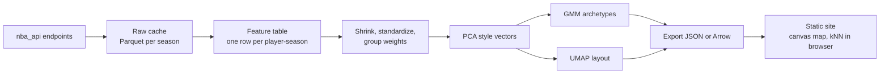

# Player style map: view spec

Draft v0.1 · September 2026 · for the svej.org NBA hub

## What it is

An interactive map where every NBA player-season is a dot, placed so that players who play alike sit near each other. Clusters on the map are data-driven archetypes that stand in for the five traditional positions. Visitors can search for a player, see his style fingerprint and archetype mix, find who plays most like him in any era, and trace how his game changed over a career.

In under a minute, a casual fan should be able to answer three questions: what kind of player is this, who else plays like this, and how has the league's style shifted over time.

## Guiding principles

**Style, not quality.** The embedding describes how a player plays, not how well. Efficiency and impact stats (TS%, BPM, on/off) stay out of the model and appear in the side panel instead. Otherwise the map sorts players into "good" and "bad" rather than by style.

**Similarity lives in model space, not in the picture.** Nearest neighbors and clusters are computed on the PCA style vectors. UMAP is used only to draw the map, because it distorts global distances.

**A stable map.** Once visitors learn where things are, the layout shouldn't reshuffle every night. Models are fit once per season, and new data is projected onto them.

**Honest about data.** Tracking and play-type data only exist for recent seasons, so the view has two modes with different feature sets, and the UI says so.

## Unit of analysis and scope

Each row is one player-season, regular season only, with at least 500 minutes played. For the current season, the threshold scales with the share of the season completed, and those points are flagged as provisional. A player traded mid-season gets one combined row (TOT).

Two feature tiers drive two modes:

| Mode | Seasons | Features | Why |
|---|---|---|---|
| Modern (default) | 2015–16 onward | Full set: box score, shot zones, tracking, play types | Richest style signal |
| All eras | 1996–97 onward | Box-score rates and shot zones only | Every season shares one space, which enables cross-era comps and the league-drift animation |

Tracking data starts around 2013–14 and play-type data around 2015–16, so Modern mode begins in 2015–16 to keep its feature set complete. Confirm these start years against the endpoints before backfilling.

Rough size: a few hundred qualifying player-seasons per year, or on the order of 4,000 rows in Modern mode and 10,000 in All eras. Both are small enough to ship to the browser.

## Features

Features are organized into groups so that no single area dominates distances just because it has more columns. After standardization, each feature is weighted by 1/√(size of its group).

| Group | Features | Tier | Likely nba_api source |
|---|---|---|---|
| Shot diet | Share of FGA from restricted area, paint (non-RA), midrange, corner 3, and above-the-break 3; FTA per FGA | Both | `LeagueDashPlayerShotLocations`, `LeagueDashPlayerStats` |
| Role | Usage rate, AST%, assist-to-usage ratio | Both | `LeagueDashPlayerStats` (Advanced) |
| Rebounding and defense | OREB%, DREB%, blocks, steals, and fouls per 100 possessions | Both | `LeagueDashPlayerStats` (Advanced, Base) |
| Self-creation | Share of made 2s and 3s that were assisted | Modern (check older coverage) | `LeagueDashPlayerStats` (Scoring) |
| Ball handling | Touches, seconds per touch, dribbles per touch, drives, passes made, and potential assists, per 36 minutes or per touch | Modern | `LeagueDashPtStats` (Possessions, Drives, Passing) |
| Shooting mode | Catch-and-shoot and pull-up shares of FGA | Modern | `LeagueDashPtStats` (CatchShoot, PullUpShot) |
| Touch location | Paint, post, and elbow touches as a share of all touches | Modern | `LeagueDashPtStats` (PaintTouch, PostTouch, ElbowTouch) |
| Play types | Share of possessions from isolation, P&R ball handler, P&R roll man, post-up, spot-up, handoff, cut, off-screen, transition, and putback | Modern | `SynergyPlayTypes` |

Endpoint names and measure-type parameters should be confirmed against the current nba_api docs before writing the fetcher.

**Kept out of the model but shown in the panel:** points per 36, TS%, height, weight, age, team, and any impact metric you like. Height makes a good color-by option precisely because it isn't an input: it lets visitors see how closely style tracks size.

### Preprocessing

**Shrink noisy rates.** Low-volume players produce extreme values (a center who took four threes all season). Blend each share or rate toward the league average with pseudo-counts, for example `share = (count + k · league_share) / (total + k)`, with a larger `k` for rarer events.

**Standardize within season.** Z-scoring each feature against that season's league distribution makes "shoots more threes than his peers" the signal, rather than raw volume that mostly tracks the calendar. This era-adjusted version drives the default layout, the archetypes, and all comps. All eras mode also gets a pooled (raw) layout, which is what makes the league's migration toward the three-point line visible in the animation.

**Compositional features.** Shot-zone and play-type shares each sum to one. Standardized shares work fine as a baseline; a centered log-ratio transform is worth testing as an experiment.

## Model

### Style vectors (PCA)

Fit PCA on the weighted, standardized feature matrix and keep enough components to explain roughly 90% of variance (expect 10–15). These vectors are the core artifact: similarity, clustering, and build-a-player all use them. Save the scaler parameters, group weights, and PCA components so the browser can project new inputs.

A learned embedding (a small autoencoder or a contrastive model) is a good stretch goal, but ship it only if it beats PCA on the evals below. Publishing that comparison is a strong portfolio piece on its own. If a contrastive model uses a player's adjacent seasons as positive pairs, the career-continuity eval is no longer independent, so hold out a set of players for it.

### Archetypes (Gaussian mixture)

Fit a Gaussian mixture model on the style vectors. Soft assignments are the point: a player can be 64% pick-and-roll creator and 28% connector wing, which describes hybrid players far better than a single label. Choose the number of components using BIC plus judgment (likely 8–12). Check stability by refitting on bootstrap samples and measuring agreement with the adjusted Rand index; merge clusters that don't hold up.

To name archetypes, compute each centroid's most distinctive features, have an LLM propose a name and one-sentence description from that profile, then edit by hand. Store names in a versioned `archetypes.json` so IDs stay pinned when models are refit.

### Map layout (UMAP)

Run UMAP on the style vectors to get 2D coordinates. Reasonable starting parameters are `n_neighbors=30`, `min_dist=0.3`, Euclidean metric, and a fixed random seed. Fit once per offseason on completed seasons, then use `transform()` for nightly current-season updates so existing points stay put. Save fitted models with joblib.

The pooled layout for All eras mode needs only its own scaler, PCA, and UMAP. It's colored by season rather than archetype, so it needs no GMM or names.

### Evaluation

| Check | Method | What good looks like |
|---|---|---|
| Career continuity | For each player-season, test whether the same player's next season appears among its 10 nearest neighbors (recall@10) | Far above a random baseline; tracked across model versions |
| Position signal | kNN classifier predicting listed position from style vectors | Clearly above chance but well short of perfect; the gap is the story |
| Cluster stability | Adjusted Rand index across bootstrap refits | High and flat around the chosen k |
| Comp sanity | A hand-written list of ~30 widely agreed comparisons, checked for top-10 hits | Most hit; misses get investigated |
| Spot checks | Manual review of top neighbors for 50 random players | No obvious nonsense |

These results go on the methodology page.

## Pipeline

Backfill completed seasons once, throttled to about one request per second, and from a home connection if stats.nba.com blocks cloud IPs. Cache raw responses as Parquet so past seasons are never fetched again. During the season, a scheduled GitHub Action refreshes only the current season, transforms it with the saved models, and commits the exported files, which triggers a site rebuild.

**Stack.** Pipeline: Python with polars or pandas, scikit-learn (`StandardScaler`, `PCA`, `GaussianMixture`), umap-learn, and joblib. Front end: Next.js static export, with d3-zoom and d3-quadtree over an HTML canvas.

## Data contract

One file per mode, `style_map_{mode}.json` (or Arrow):

| Field | Type | Notes |
|---|---|---|
| `player_id` | int | stats.nba.com ID |
| `name` | string | |
| `season` | string | For example, `2024-25` |
| `team` | string | Abbreviation; `TOT` for multi-team seasons |
| `minutes` | int | Drives dot size |
| `provisional` | bool | True for current-season rows |
| `x`, `y` | float32 | Era-adjusted layout |
| `x_pooled`, `y_pooled` | float32 | All eras mode only, for the drift animation |
| `vec` | float32[~12] | PCA style vector |
| `arch` | float32[k] | Archetype probabilities |
| `fingerprint` | float32[groups] | Group-level z-scores for the panel |
| `panel` | object | PTS/36, TS%, height, age |

Two supporting files: `archetypes.json` (id, name, description, color, top features) and `model_meta.json` (feature names, scaler means and scales, group weights, PCA components, model version, and data-through date).

Keep each mode under about 2 MB gzipped, and lazy-load All eras mode.

## UI

### Layout

A control bar runs across the top with player search (autocomplete), a Modern / All eras toggle, a color-by menu (archetype, season, team, height, TS%), and an era-adjusted switch that appears in All eras mode.

The map fills the left side on desktop. Dots are colored by archetype and sized by minutes. Hovering shows name, season, team, and top archetype; scrolling and dragging zoom and pan. A season range slider with a play button sits under the map, and the archetype legend below it doubles as a filter: clicking a name highlights that cluster and dims the rest.

Selecting a player opens the side panel. Its header shows name, season, team, minutes, and the archetype mix as a single stacked bar. Below that, the style fingerprint is a diverging bar chart of group-level z-scores; bars read more accurately than a radar chart and handle negative values cleanly. "Plays most like" lists the eight nearest player-seasons with similarity scores, with switches for same era vs. any era and for hiding the player's own other seasons. Two actions close out the panel: **Career path** draws a line through all of that player's seasons on the map, and **Compare** lets the visitor pick a second player and overlays both fingerprints.

On mobile, the map goes full width, the panel becomes a bottom sheet, and tap replaces hover.

### Interactions worth building

**Season animation.** The play button steps through seasons on the pooled All eras layout, colored by season, so visitors watch the league migrate toward the three-point clusters. This is the most shareable moment in the view.

**Guided tour.** First-time visitors get three or four short stops: what the map shows, a surprising pair of comps, a career path that changed shape, and the drift animation. Many portfolio visitors won't explore on their own.

**Shareable URLs.** Mode, selected player, season, and color-by live in the query string, so any view can be linked.

**Build a player (v2).** Six sliders for intuitive traits (three-point rate, rim rate, usage, assist rate, rebounding, rim protection) set part of a feature vector, and the remaining features stay at the league average (a z-score of 0). The browser projects that vector through the saved scaler and PCA, finds its nearest neighbors, and places a ghost dot at the average map position of those neighbors, since UMAP can't cheaply run client-side.

**Client-side similarity.** Nearest neighbors are a brute-force cosine search over about 10,000 short vectors, which takes a few milliseconds, so nothing needs precomputing. Hover hit-testing uses a quadtree.

### Methodology page

A companion page shows the pipeline diagram, feature table, evaluation results, model version, data-through date, and limitations. For hiring managers, this page matters as much as the map.

## Limitations to state on the site

Style is partly system: a player's numbers reflect his coach and teammates as well as his own tendencies. All eras mode uses coarser features, so older comparisons are less precise. The minutes threshold drops injury-shortened seasons. Tracking definitions have changed over the years. Early-season points are noisy and marked provisional.

## Legal and brand hygiene

Keep the project noncommercial, attribute the data source, avoid NBA and team logos, and use initials rather than hotlinked player headshots. Review the stats.nba.com terms of use before launch.

## Milestones

| Milestone | Scope |
|---|---|
| 1 | Backfill Modern seasons, build the feature table, fit PCA and GMM in a notebook, sanity-check neighbors |
| 2 | UMAP layout, export pipeline, static map with hover, search, selection, and neighbors |
| 3 | Fingerprint panel, archetype names, career path, compare, shareable URLs, mobile layout |
| 4 | All eras mode, season animation, guided tour, methodology page, nightly GitHub Action live before opening night |
| Stretch | Build a player; learned embedding vs. PCA comparison |
