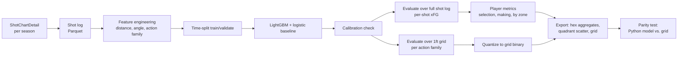

# Shot quality court: view spec

Draft v0.1 · September 2026 · for the nba-atlas hub

## What it is

An interactive half-court that separates two skills box scores blur together: taking good shots and making tough ones. Every shot in the league is scored against an expected field-goal probability (xFG) model, and every player gets two numbers — shot selection (are the shots he takes good ones?) and shot making (does he make more than expected, given the shots he takes?). Visitors can browse any player's shot chart as hexagons colored by performance vs. expected, see the whole league on a shot-selection-vs-shot-making scatter, and click anywhere on the court to see what the model predicts for a given shot type.

In under a minute, a visitor should be able to answer: does this player take good shots, is he better than average at making them, and how does he compare to the rest of the league.

## Guiding principles

**Separate selection from making.** A player who takes only layups and dunks will have a high raw FG% without necessarily being a "good shooter." xFG lets us credit degree of difficulty. Selection and making are reported as two separate numbers, never blended into one score.

**League-average model, not player-specific.** The model estimates what an average NBA player would shoot from a given location and situation. It deliberately excludes player identity, so "shot making" is defined as outperforming that baseline — that's the whole point of the metric.

**Calibration over accuracy.** A model that's well calibrated (when it says 40%, shots go in 40% of the time) is more useful here than one that's marginally more accurate but poorly calibrated, since every player metric is built on top of the predicted probabilities.

**Ship a lookup table, not a model.** The trained model lives in the pipeline only. The site ships a precomputed grid, which is what keeps this view free and fast.

## Unit of analysis and scope

Each row is one field goal attempt (make or miss), regular season only, from 2015–16 onward — the era for which shot-location data (`ShotChartDetail`) is reliably available at scale. That's on the order of 200,000 attempts per season, roughly 2 million rows for a decade of backfill.

Free throws are excluded (no defense, no shot selection). And-one free throws are not modeled as separate events; the parent field goal attempt is scored normally and the bonus point is not folded into xFG.

## Features

Confirm exact field names and coordinate conventions in `ShotChartDetail` before writing the fetcher — coordinate origin, units (likely tenths of a foot), and whether angle needs to be derived or is provided.

| Feature | Description | Source |
|---|---|---|
| Location (x, y) | Court coordinates, hoop-relative | `ShotChartDetail` |
| Distance | Straight-line distance from hoop, in feet | Derived from x, y |
| Angle | Angle from the hoop centerline | Derived from x, y |
| Shot value | 2 or 3 | `ShotChartDetail` |
| Action family | Grouped from `ACTION_TYPE`: layup, dunk, hook, floater, catch-and-shoot jumper, pull-up jumper, step-back, fadeaway, tip, alley-oop (confirm which families the raw action types actually support — may need to merge rare ones) | Derived |
| Period | 1–4, or 5+ for overtime | `ShotChartDetail` |
| Seconds left in period | Continuous | `ShotChartDetail` (or derived from game clock) |
| End-of-quarter heave flag | True if attempted with under 3 seconds left in a period from beyond 30 feet | Derived |

**Deliberately excluded:** player identity, defender distance and identity (not available in public shot-level data), shot clock time (verify availability; include as a stretch feature if present and reliable), and any post-shot outcome data.

### Preprocessing

- Deduplicate on game ID, player ID, and event number.
- Drop or flag shots with clearly invalid coordinates (outside the court bounds, or exactly at the origin, which sometimes indicates a data error).
- One-hot or target-encode action family; use natural splines on distance and angle rather than raw linear terms, since shot-make probability is highly nonlinear in both.
- Balance classes are not an issue (makes and misses are both well represented), so no resampling is needed.

## Model

### Baseline: logistic regression

A logistic regression with distance splines, angle, action family, shot value, period, and seconds remaining. This is the model to beat, and it's also useful as a sanity check on the more flexible model, since a big win for LightGBM in a region where the two disagree often indicates overfitting rather than signal.

### Primary: LightGBM classifier

Gradient-boosted trees on the same feature set, no interaction terms needed since trees find them. Time-based split: train on all seasons except the most recent completed one, validate on that season, and only fit the final production model on the full training window (including the most recent completed season) once hyperparameters are locked. Never split randomly across seasons — that would leak information about a season's overall shooting environment into both splits.

**Suggested starting hyperparameters:** shallow-to-medium trees (max depth 4–6), a few hundred to low thousands of estimators with early stopping on the validation season, and column subsampling to reduce overfitting on the categorical action family feature. Tune modestly; this is not the kind of problem that needs an extensive search, and an overtuned model risks overfitting one season's shooting environment.

### Evaluation

| Metric | What it checks |
|---|---|
| Log loss | Overall probabilistic fit |
| Brier score | Overall probabilistic fit, more interpretable |
| AUC | Discrimination (can the model separate makes from misses at all) |
| Calibration curve | Bin predictions into deciles; plot predicted vs. actual make rate in each bin |
| Calibration by action family | Same curve, computed separately for layups, threes, and midrange, since a model can be calibrated overall while off in a specific zone |

Target: calibration within about 2–3 percentage points across deciles, with no systematic bias by zone (for example, consistently underrating restricted-area shots). If the LightGBM model is materially better calibrated than logistic regression, ship it; if they're close, prefer logistic regression for simplicity and easier grid derivation. Report both curves on the methodology page regardless of which model ships.

Isotonic or Platt calibration on the validation season is worth trying if the raw model is off; note whichever is used in `docs/decisions.md`.

## From model to lookup grid

The browser never runs the model directly. Instead, the pipeline evaluates the trained model over a fixed grid and exports the predictions as a lookup table.

**Grid definition:** 1-foot-square cells across the offensive half court (roughly 50 by 47 feet, so about 2,350 cells). For each cell, use the cell's center coordinates to compute distance and angle.

**Per-action-family grids:** Because make probability depends heavily on action family (a layup and a step-back three from similar locations have very different probabilities), the export includes one grid per action family, evaluated at a fixed "typical" period and seconds-remaining (regulation, mid-shot-clock) so the click-anywhere feature reflects a normal-context shot rather than a garbage-time heave.

**Quantization:** Store each cell's probability as a single byte (0–255, linear scale), which caps the export at roughly `2,350 cells × 10 action families ≈ 23,500 bytes` before compression — trivially small. Quantization error is at most about 0.4 percentage points, well inside the calibration tolerance.

**Parity test:** After exporting, re-run the trained model on a sample of grid-cell centers directly in Python and compare against the quantized grid values from the export file. This catches silent bugs in the grid-generation code (wrong coordinate transform, wrong action-family encoding) that wouldn't show up in the model's own metrics.

### Per-shot xFG for player metrics

Player-level metrics need the model's prediction for the exact shot taken (exact coordinates and game context), not the coarser grid. This full computation happens once in the pipeline over the whole shot log — it does not need to be fast, since it runs offline. The grid is only for the browser's interactive "click anywhere" feature.

## Player metrics

Computed per player-season, with shrinkage toward league average for low-volume players (a player with 40 shots shouldn't post an extreme selection or making score).

| Metric | Definition |
|---|---|
| Shot selection | Player's average predicted xFG per shot, minus league-average xFG per shot, shrunk toward zero by attempt volume |
| Shot making | Player's actual points per shot, minus expected points per shot (using xFG and shot value), shrunk the same way |
| Attempts, FG%, xFG% by zone | Restricted area, paint (non-RA), midrange, corner three, above-the-break three |

## Pipeline

**Stack.** Pipeline: Python, polars, LightGBM, scikit-learn (for the logistic baseline and calibration), joblib. Front end: HTML canvas for the court, hex binning done in Python and shipped as precomputed aggregates (no client-side binning needed).

## Data contract

**Hex aggregates**, sharded by `player_id % 32` per season (`shot_hexes_{season}_{shard}.json`):

| Field | Type | Notes |
|---|---|---|
| `player_id` | int | |
| `season` | string | |
| `hexes` | array of objects | one per occupied hex |
| `hexes[].hex_id` | string | fixed grid ID |
| `hexes[].attempts` | int | |
| `hexes[].makes` | int | |
| `hexes[].xfg_sum` | float32 | sum of per-shot xFG, for computing hex-level xFG% |

**League-average hex file** per season, same shape, aggregated across all players (used as the comparison baseline when coloring by FG% minus xFG%).

**Quadrant scatter** (`shot_quadrant_{season}.json`): one row per qualified player-season with `player_id`, `name`, `selection`, `making`, `attempts`.

**xFG grid** (`xfg_grid.bin`): a flat byte array, one grid per action family concatenated with a small JSON header (`xfg_grid_meta.json`) describing family order, cell size, and court bounds.

Keep each per-season shard under 300 KB gzipped and the grid file under 100 KB.

## UI

### Layout

A half-court fills most of the view, drawn as an HTML canvas with hexagons sized by attempt frequency and colored on a diverging scale (FG% minus xFG%), with a toggle to color by raw xFG% instead of the differential. A legend states the color scale explicitly, since the diverging palette alone isn't enough for colorblind accessibility.

Player search and a season picker sit above the court. Below it, a shot-selection-vs-shot-making scatter plots every qualified player-season, with the current player highlighted; hovering any point shows name and season, and clicking loads that player onto the court.

An action-type dropdown plus "click anywhere on the court" shows the grid-based xFG prediction for that shot type at that location, which lets visitors build intuition for how the model sees shot difficulty across the floor independent of any specific player.

### Interactions worth building

**Zone breakdown table.** A small table under the court: attempts, FG%, and xFG% by zone, so the hex map's visual read is backed by exact numbers.

**Compare mode.** Two players' hex maps side by side, or a difference map (this player's FG% minus xFG% minus that player's), for direct comparisons.

**Shareable URLs.** Player, season, and color-by mode in the query string.

### Methodology page section

Calibration curves (overall and by action family), the logistic-vs-LightGBM comparison, the grid parity test result, and stated limitations.

## Limitations to state on the site

No defender distance or identity in public shot-location data, so xFG reflects location and shot type, not actual defensive pressure. Shot clock context isn't fully captured. And-one free throws aren't folded into the expected-points calculation. Action family classification depends on how the source data labels shot types, which is sometimes ambiguous (a step-back that's also a fadeaway, for instance).

## Legal and brand hygiene

Same as the rest of the hub: noncommercial, attribute the data source, no team or league logos, review stats.nba.com's terms of use before launch.

## Milestones

| Milestone | Scope |
|---|---|
| 1 | Backfill shot logs, build features, fit logistic baseline and LightGBM, produce calibration report |
| 2 | Export per-shot xFG over the full log, compute player metrics, build the 1ft grid and quantize it, write the parity test |
| 3 | Static court view with hex map, zone table, player search, season picker |
| 4 | Quadrant scatter, click-anywhere grid lookup, compare mode, shareable URLs |
| 5 | Methodology page section, mobile layout |
